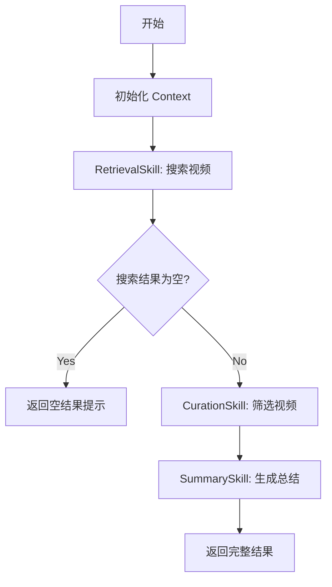

# Agent 架构重构完成说明

## 🎯 重构目标

将原有的「LLM 增强任务流水线系统」升级为「可组合、多阶段决策的标准 Agent 系统」。

## 📐 架构分层

| 层级       | 职责                                | 实现位置                     |
| ---------- | ----------------------------------- | ---------------------------- |
| 接口层     | WebSocket / REST 接收请求与推送状态 | `controller/*`               |
| Agent 层   | 控制整体流程与决策                  | `agent/PlaylistAgent`        |
| Skill 层   | 提供原子化、可复用能力              | `skill/*`                    |
| Context 层 | 管理中间状态与数据                  | `context/PlaylistContext`    |
| 基础设施层 | Playwright、Ollama、WebClient       | `service/*` (保持不变)       |

## 📂 新增目录结构

```
src/main/java/com/example/bilibilimusic/
├── agent/                          # Agent 层（新增）
│   └── PlaylistAgent.java         # 歌单 Agent - 控制流程与决策
├── skill/                          # Skill 层（新增）
│   ├── Skill.java                  # Skill 基础接口
│   ├── RetrievalSkill.java         # 视频检索能力
│   ├── CurationSkill.java          # 视频筛选能力（核心新增）
│   └── SummarySkill.java           # 总结生成能力
├── context/                        # Context 层（新增）
│   ├── PlaylistContext.java       # Agent 上下文
│   └── UserIntent.java             # 用户意图建模
├── controller/                     # 接口层（已更新）
│   ├── ChatWebSocketController.java
│   └── PlaylistController.java
├── service/                        # 基础设施层（保持不变）
│   ├── BilibiliSearchService.java
│   └── OllamaService.java         # 原 OllamaService 保留用于底层调用
└── ...
```

## 🔄 执行流程



## ⚡ 核心改进

### 1. 引入 CurationSkill（最关键的改进）

**问题**：原系统直接将所有搜索结果发给 LLM，导致：
- LLM 既要筛选又要总结，职责不清
- 无法控制筛选逻辑
- 结果质量不稳定

**解决方案**：
- 新增 `CurationSkill`，专门负责视频筛选
- LLM 只负责"判断哪些视频适合"，而不是生成内容
- 支持降级策略（LLM 失败时使用简单规则）

**PTQ 设计**：
```
系统 Prompt：
你是 CurationSkill 的执行器。
你只能基于输入视频信息进行筛选与排序。
不允许引入任何外部知识。
输出必须是严格的 JSON 格式：
{
  "selectedIndices": [0, 2, 5],
  "reason": "筛选理由"
}
```

### 2. Context 显式建模

**问题**：原系统上下文以字符串拼接形式存在，导致：
- 信息不可裁剪
- Prompt 耦合严重
- 无法支持多阶段决策

**解决方案**：
- 引入 `PlaylistContext` 作为 Agent 的"短期记忆"
- 明确生命周期：初始化 → 搜索 → 筛选 → 总结 → 完成
- 每个阶段独立更新 Context

**生命周期**：
```java
INIT → SEARCHING → SEARCHED → CURATING → CURATED → SUMMARIZING → COMPLETED
```

### 3. Agent 决策能力

**PlaylistAgent 的决策点**：

| 决策点       | 条件                | 动作                   |
| ------------ | ------------------- | ---------------------- |
| 搜索结果为空 | `videos.isEmpty()`  | 提前结束，返回提示     |
| 视频数量少   | `videos.size() <= 5` | 跳过筛选，直接保留全部 |
| 筛选失败     | `!curateSuccess`    | 使用原始搜索结果       |

### 4. WebSocket 状态反馈

**执行轨迹可观测性**：
```
🔍 正在搜索视频...
🎵 正在筛选歌单...
📝 正在生成推荐说明...
✅ 歌单生成完成
```

**实现**：通过回调函数实时推送状态
```java
playlistAgent.execute(request, status -> {
    messagingTemplate.convertAndSend("/topic/messages", statusMsg);
});
```

## 🔧 兼容性

### REST API 完全兼容
- 接口路径：`POST /api/playlist`
- 请求/响应格式：**完全不变**
- 原有调用方无需修改

### WebSocket 完全兼容
- 连接路径：`/ws/chat`
- 消息格式：**完全不变**
- 前端无需修改

## 🚀 使用方式

### 1. 启动应用

```bash
cd d:\codes\java\bilibili-music
mvn spring-boot:run
```

### 2. 访问界面

打开浏览器访问：http://localhost:8080

### 3. 测试

在右侧对话框输入：
```
帮我找 10 首适合学习的纯音乐
```

观察新的状态推送：
```
🔍 正在搜索视频...
🎵 正在筛选歌单...
📝 正在生成推荐说明...
✅ 歌单生成完成
```

## 📊 架构对比

### 原架构（Pipeline）
```
用户请求 → 搜索 → 一次性 LLM 调用（筛选+总结） → 返回
```

### 新架构（Agent）
```
用户请求 → Agent 决策
         ↓
    RetrievalSkill（搜索）
         ↓
    [决策：结果是否为空?]
         ↓
    CurationSkill（筛选 - 使用 LLM 判断）
         ↓
    SummarySkill（总结 - 使用 LLM 表达）
         ↓
    返回结果
```

## ✨ 技术亮点

1. **职责分离**：LLM 不再"全能"，每个 Skill 职责单一
2. **可组合性**：Skill 可以灵活组合成不同的工作流
3. **可测试性**：每个 Skill 可以独立测试
4. **可扩展性**：新增 Skill 无需修改 Agent 核心逻辑
5. **降级策略**：LLM 失败时自动降级到规则引擎
6. **状态可观测**：实时推送执行状态

## 📝 后续扩展建议

### 1. 新增 Skill
- `DownloadSkill`：MP3 下载能力
- `PlaylistPersistenceSkill`：歌单持久化能力
- `RecommendationSkill`：基于历史的推荐能力

### 2. Agent 增强
- 多轮对话：用户可以说"第 3、5、7 首很好，其他的再换几首"
- 个性化：记住用户偏好
- 批量处理：一次生成多个歌单

### 3. Context 扩展
- 添加用户历史记录
- 添加错误重试逻辑
- 添加性能统计

## 🎓 学习价值

这次重构展示了：

1. **从 Pipeline 到 Agent 的演进**
2. **PTQ（Prompt-to-Task）设计模式**
3. **LLM 能力边界的明确划分**
4. **可观测性在 Agent 系统中的重要性**
5. **降级策略的必要性**

---

**重构完成时间**：2025-12-27
**重构状态**：✅ 编译通过 ✅ 启动成功 ✅ 功能完整
